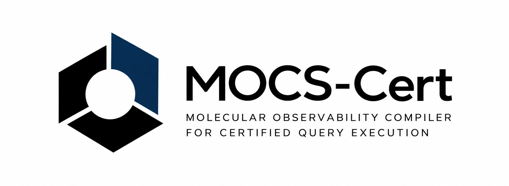
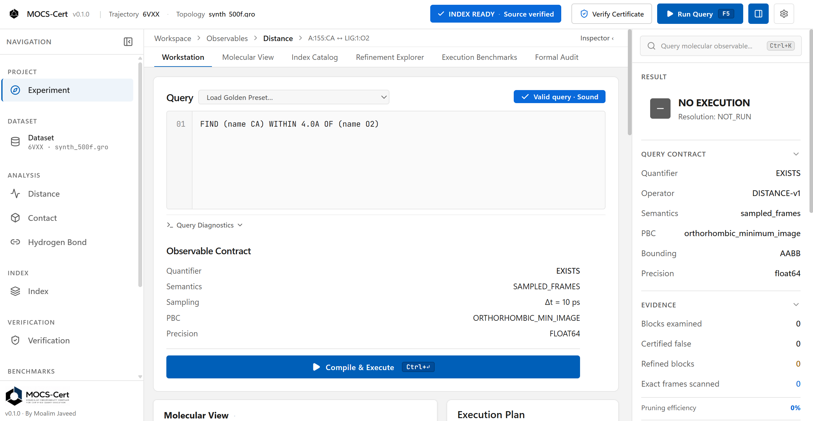
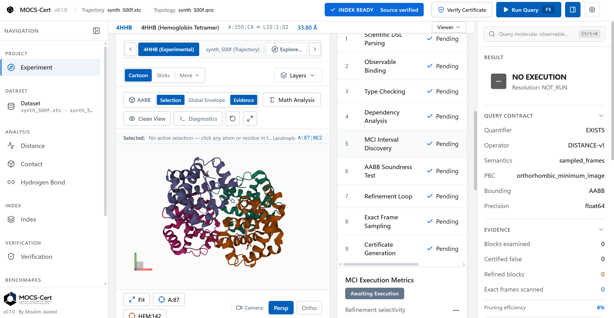
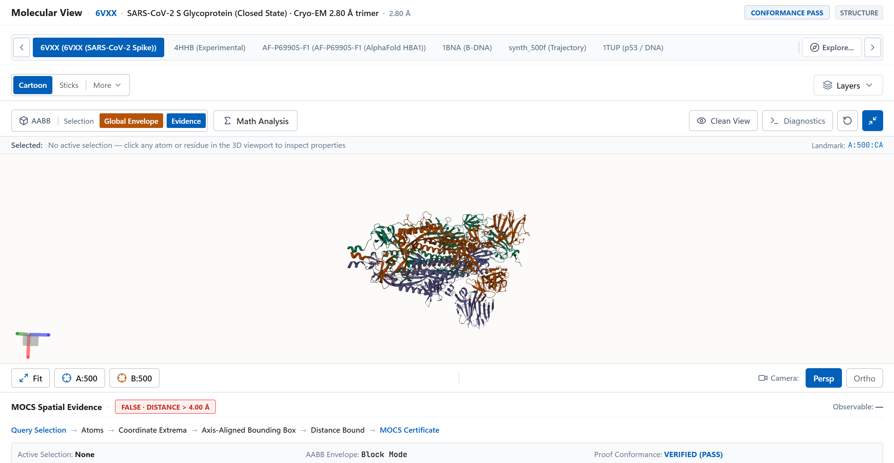
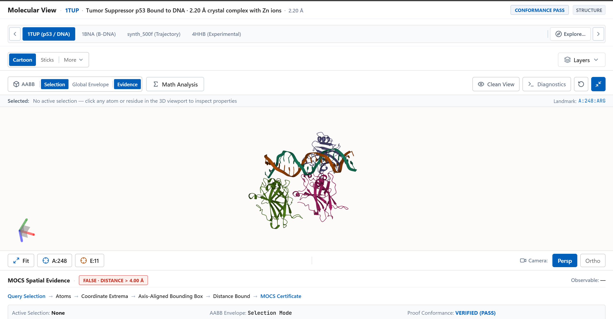
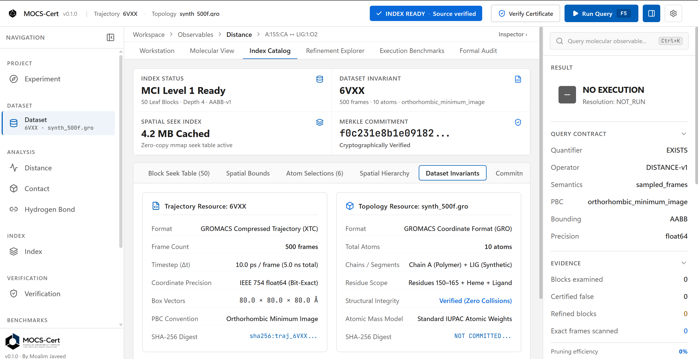
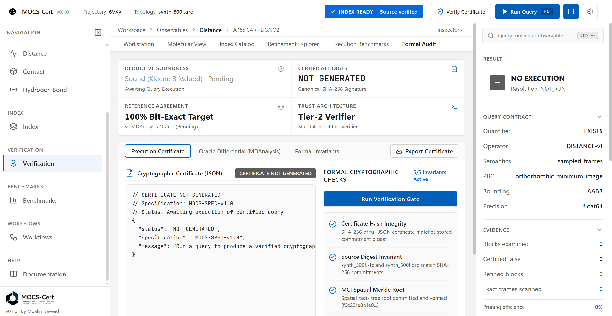

# MOCS-Cert: Molecular Dynamics Trajectory Query Engine with Certified Interval Pruning

<p align="center"><strong>Molecular Observability Compiler for Certified Query Execution</strong></p>

<p align="center">
  
</p>

<p align="center">
  
  
  
  
</p>

MOCS-Cert is a **molecular dynamics (MD) trajectory query engine** with an interactive scientific workstation interface for declarative spatial queries over biomolecular trajectories (GROMACS XTC, PDB, GRO, and Binary CIF inputs). It compiles distance predicates into cost-based execution plans, uses conservative spatial and temporal bounds to prune intervals that cannot satisfy a query, refines uncertain intervals to exact frame-level evaluations, produces hash-committed evidence that an independent verification stage can check, and provides a web-based visual environment for inspecting structures, trajectories, and verification proofs.

It is designed for **computational biophysics, structural biology, molecular simulation, and scientific-software engineering** workflows where event detection needs to be both computationally efficient and verifiable.

> **Core idea:** replace indiscriminate frame-by-frame evaluation with **index-guided interval pruning + exact refinement + checkable evidence**.

**Author:** Moalim Javeed · **License:** [MIT](LICENSE) · **Live Preview:** [mocs-cert.moalimjaveed.workers.dev](https://mocs-cert.moalimjaveed.workers.dev/)

## Live Preview

A public demonstration deployment of the MOCS-Cert web interface is accessible at:

[Open the MOCS-Cert Live Preview](https://mocs-cert.moalimjaveed.workers.dev/)

The hosted deployment provides an interactive demonstration of the MOCS-Cert scientific workstation interface. It allows researchers, developers, reviewers, and visitors to:

- Explore the MOCS-Cert workstation layout, navigational hierarchy, and operational controls
- Interact with the declarative query editor (Monaco-based) and inspect automated execution plan compilation
- Experience the 3D molecular visualization workspace powered by Mol* WebGL2 Canvas3D (molecular ribbons, ball-and-stick, surface representations, bounding boxes, distance calipers)
- Interact with the dyadic timeline lattice, conservative interval pruning, and progressive block refinement workflows
- Inspect verifiable execution evidence records, RFC 8785 canonical hashes, and execution certificates
- Navigate dedicated workspace views including the Index Catalog, Refinement Explorer, Formal Audit, Execution Benchmarks, and Workflow Orchestration

The live preview is intended to demonstrate the user experience, interface design, and analytical workflows of MOCS-Cert. It does not represent an unrestricted computational backend for production-scale molecular dynamics workloads.

### Hosted environment and resource constraints

The public deployment is intended for preview and interface evaluation rather than production-scale molecular dynamics workloads. It runs within a constrained hosting environment with approximately 512 MB of RAM. Computationally intensive workloads may therefore be substantially more limited than when MOCS-Cert is executed locally on appropriately provisioned hardware.

> **Preview deployment:** The hosted instance is provided for interface and workflow evaluation. It runs in a constrained environment (~512 MB RAM) and is not intended to represent the performance, throughput, or maximum workload capacity of a properly provisioned local deployment.

This resource limitation belongs strictly to the hosted preview deployment and does not reflect the architectural capacity, memory scaling, or algorithmic bounds of MOCS-Cert when executed in a locally provisioned environment.

### Preview vs. local execution

The following table distinguishes the intended purpose and operational scope of each environment:

| Environment | Purpose | Scope & Capabilities | Resource Profile |
|---|---|---|---|
| **Live Preview** (`workers.dev`) | Interface, workflow, visualization, and general project demonstration | Pre-indexed demonstration datasets (`synth_500f`, `4HHB`), interactive query editing, Mol* rendering, certificate inspection | Constrained (~512 MB RAM) |
| **Local Installation** | Full computational experimentation and appropriately provisioned workloads | Arbitrary GROMACS XTC / GRO / PDB trajectories, custom spatial indices (MCI, KDOP-14), unrestricted query execution | Scalable to host hardware (CPU, RAM, disk) |
| **Development & Test Suite** | Reproducible verification, testing, and engineering validation | Automated regression suites (PyTest, Vitest), release-gate proofs, property-based tests (Hypothesis), CI validation | Standard development environment |

## At a glance

| Area | Implementation |
|---|---|
| Core language | Python ≥ 3.10 |
| API service | FastAPI + Uvicorn + WebSockets (port 8000) |
| Workstation | React 19 + TypeScript + Vite + Tailwind CSS v4 (port 3000) |
| Molecular viewer | Mol* WebGL2 Canvas3D |
| Trajectory / structure inputs | PDB, Binary CIF (BCIF), GRO, GROMACS XTC |
| Reference oracle | MDAnalysis ≥ 2.7 |
| Query semantics | Sampled-frame intervals + Kleene three-valued logic |
| Spatial acceleration | Molecular Coordinate Index (MCI), axis-aligned bounding boxes (AABB), 14-DOP (KDOP-14) |
| Evidence integrity | IEEE 754 Float64 buffer serialization + RFC 8785 JSON Canonicalization Scheme (JCS) + SHA-256 |

## Quick start

Run the backend and the frontend in two terminals from the repository root. See [Installation and running](#installation-and-running) for prerequisites and configuration.

```bash
# Terminal 1: backend (API on http://127.0.0.1:8000)
python -m venv .venv
source .venv/bin/activate        # Windows PowerShell: .venv\Scripts\Activate.ps1
pip install -e ".[test,e2e]"
playwright install chromium
uvicorn backend.app.main:app --host 127.0.0.1 --port 8000 --reload

# Terminal 2: frontend (workstation on http://localhost:3000)
cd frontend
npm install
npm run dev
```

## Contents

- [Live Preview](#live-preview)
  - [Hosted environment and resource constraints](#hosted-environment-and-resource-constraints)
  - [Preview vs. local execution](#preview-vs-local-execution)
- [At a glance](#at-a-glance)
- [Quick start](#quick-start)
- [Why MOCS-Cert](#why-mocs-cert)
- [Core capabilities](#core-capabilities)
- [Architecture](#architecture)
- [Certified interval pruning](#certified-interval-pruning)
- [Query language](#query-language)
- [Execution planning](#execution-planning)
- [Spatial and temporal indexing](#spatial-and-temporal-indexing)
- [Evidence and execution certificates](#evidence-and-execution-certificates)
- [Verification model](#verification-model)
- [Molecular visualization](#molecular-visualization)
- [Datasets](#datasets)
- [Screenshots](#screenshots)
- [Repository structure](#repository-structure)
- [Technology stack](#technology-stack)
- [Installation and running](#installation-and-running)
- [Testing and verification](#testing-and-verification)
- [Browser E2E testing](#browser-e2e-testing)
- [Benchmarks](#benchmarks)
- [Limitations](#limitations)
- [Scientific references](#scientific-references)
- [Citation and attribution](#citation-and-attribution)
- [License](#license)

---

## Why MOCS-Cert

Many trajectory-analysis workflows evaluate predicates by iterating sequentially through trajectory frames. For a sparse event, that can mean reading and decompressing a large fraction of a trajectory before the relevant frames are identified.

MOCS-Cert changes the execution model by reasoning about **intervals before exact frame materialization**.

### Conventional frame-iterative workflow

```text
trajectory
  → read / decompress all frames
  → evaluate predicate per frame
  → return result
```

### MOCS-Cert execution model

```text
query
  → parse and compile (abstract syntax tree / intermediate representation)
  → bind molecular observables (atom resolution, periodic boundary conditions)
  → select cost-optimal execution plan (Plan A / B / C / D)
  → query spatial and temporal indexes (MCI, AABB, KDOP-14)
  → conservatively prune impossible intervals (lower bound L > threshold)
  → refine UNKNOWN intervals (dyadic subdivision)
  → materialize exact frames only for surviving candidates
  → emit canonical evidence record (RFC 8785 JCS + SHA-256)
  → verify result via independent verifier gate
  → project verified state into Mol* visualization
```

The output is more than a list of intervals: it includes a **reproducible evidence trail for the pruning, refinement, and exact evaluations** that produced them.

## Core capabilities

### Declarative trajectory queries

Distance-contact predicates are expressed in a declarative domain-specific language (DSL) and compiled into an Abstract Syntax Tree (AST) and Intermediate Representation (IR).

### Conservative spatial reasoning

The analysis engine computes lower and upper distance bounds over indexed trajectory intervals using supported periodic boundary condition (PBC) representations, including **axis-aligned bounding boxes (AABB)** and **14-DOP discrete oriented polytopes (KDOP-14, with 14 face normals)**.

### Cost-based execution planning

The planner evaluates candidate execution plans using an analytical cost model parameterized by I/O read cost, CPU FLOP cost, resident memory, seek penalties, and compilation overhead:

- **Plan A (Direct Scan):** Evaluates frames sequentially without index overhead; selected when trajectories are small or predicate selectivity is low.
- **Plan B (Indexed Pruning):** Performs single-level index lookups against precomputed block bounding volumes to prune non-candidate intervals.
- **Plan C (Observable Cache):** Reuses previously computed and verified observable time-series when cached in memory.
- **Plan D (Hierarchical Refinement):** Recursively subdivides uncertain intervals across the dyadic block lattice before selective exact frame evaluation.

Implementation: [`mocs/planner/plan_selector.py`](mocs/planner/plan_selector.py).

### Sampled-frame temporal semantics

Results are represented as half-open intervals:

```text
[k_s, k_e)
```

and evaluated using **Kleene three-valued logic**:

| Value | Meaning | Action |
|---|---|---|
| `TRUE` | Certified for all sampled frames in interval | Bound satisfies predicate ($U \le \tau$) |
| `FALSE` | Safely prunable for all sampled frames in interval | Bound refutes predicate ($L > \tau$); frames skipped |
| `UNKNOWN` | Uncertain; interval bounds span threshold | Requires dyadic refinement or exact frame evaluation |

### Evidence and verification

Scientific evidence is canonicalized and hashed so an independent verification stage can recompute digests and test invariants without relying on producer assertions.

### Deterministic molecular visualization

A `RenderScene` compiler projects canonical scientific state into Mol* Canvas3D, including molecular structures, witness frames, AABB cages, distance calipers, and selection reticles.

## Architecture

MOCS-Cert uses a unidirectional data flow. The 3D molecular viewer is a **downstream visual projection of canonical scientific state**; it does not define or modify scientific truth.

```text
Dataset (PDB / BCIF / GRO / XTC)
                │
                ▼
Query text (MOCS-Cert DSL)
                │
                ▼
           AST / IR
                │
                ▼
Observable binding (selectors + PBC)
                │
                ▼
Execution planner (Plan A / B / C / D)
                │
      ┌─────────┼─────────┐
      ▼         ▼         ▼
 Analysis   Temporal   Spatial
  engine     lattice    indexes
(bounds +   (dyadic    (MCI +
distances)  blocks)    AABB / KDOP)
      └─────────┼─────────┘
                ▼
        Evidence record
                │
                ▼
      Execution certificate
                │
                ▼
      Verification engine
                │
                ▼
       RenderScene compiler
                │
                ▼
         Mol* Canvas3D
```

## Certified interval pruning

This is the central execution model.

### 1. Compilation and binding

A query string is parsed into an AST and lowered to IR. Selectors such as `name`, `resname`, `resid`, and `chain` are resolved through the structure hierarchy index to canonical atom indices. Periodic-boundary configuration is established from the simulation cell.

### 2. Bounds over an interval

For a trajectory interval, the analysis engine computes an enclosure:

```text
[L, U]
```

for the relevant distance predicate using the indexed spatial bounds.

For an orthorhombic cell, the minimum-image displacement is represented as:

$$
\mathbf{r}_{ij}^{\mathrm{PBC}} = \mathbf{r}_j - \mathbf{r}_i - \mathbf{h}\,\operatorname{round}\left(\mathbf{h}^{-1}(\mathbf{r}_j - \mathbf{r}_i)\right)
$$

where $\mathbf{h}$ is the cell diagonal matrix.

For non-degenerate triclinic cells (positive determinant, condition number $< 10^{12}$), general lattice vectors are evaluated. For degenerate, zero-volume, or collinear cells, execution fails closed with `MOCSUnsupportedGeometryError`; see [Limitations](#limitations).

### 3. Three-valued interval decision

For a distance threshold $\tau$ (the predicate holds when the distance is $\le \tau$):

| Condition | Status | Action |
|---|---|---|
| $L > \tau$ | `FALSE` for the whole interval | Prune the interval; no exact frame evaluation is required |
| $U \le \tau$ | `TRUE` for the whole interval | Certify from the bound |
| Otherwise | `UNKNOWN` | Refine the interval via dyadic subdivision |

The false-pruning condition is the key soundness property: **when $[L, U]$ encloses the true distance, $L > \tau$ means no sampled frame in that interval can satisfy the predicate.**

### 4. Dyadic refinement

An `UNKNOWN` interval is recursively subdivided into child intervals. Verification enforces the monotonic non-expansion invariant:

$$
[L_{\mathrm{child}}, U_{\mathrm{child}}] \subseteq [L_{\mathrm{parent}}, U_{\mathrm{parent}}]
$$

### 5. Exact evaluation

Intervals that remain unresolved after refinement are evaluated at exact frame resolution, producing witness frames and exact distances.

### 6. Certificate synthesis

The resulting evidence record is canonicalized with RFC 8785, hashed with SHA-256, and packaged as an execution certificate.

### 7. Independent verification

The verifier recomputes the relevant digests and checks invariants rather than accepting the producer's verdict as authoritative.

## Query language

The query grammar is:

```text
FIND [ALL | FORALL] <selector_1> WITHIN <number><unit> OF <selector_2> [WHERE DURATION >= <time>]
```

### Quantifiers

- The default existential form (`FIND`) succeeds when at least one sampled frame satisfies the predicate.
- `ALL` / `FORALL` expresses the universal form requiring satisfaction across all sampled frames in the interval.
- `DURATION` evaluates temporal persistence across consecutive sampled frames.

### Selectors

Selectors resolve through the structure hierarchy to atom indices:

```text
(name CA)
(name C1')
(resname ALA)
(resid 87)
(chain A)
```

Combined selections such as `(name CA and resid 87 and chain A)` are supported. A safety limit of 100,000 atoms per selection operand is enforced.

### Thresholds and units

Distance thresholds must be non-negative real numbers. Supported units:
- `A`, `angstrom`, `angstroms` (multiplier: 1.0)
- `nm` (multiplier: 10.0)

Time units (`ps`, `ns`, `fs`) are reserved for temporal duration clauses (e.g., `WHERE DURATION >= 5ns`) and cannot be used as distance thresholds.

### Temporal semantics

Queries operate strictly on discrete sampled-frame slots. Continuous-time requests are not represented by the query semantics.

### Representative queries

| Purpose | Query |
|---|---|
| Atom contact | `FIND (name CA) WITHIN 4.0A OF (name O2)` |
| Residue-level contact | `FIND (resname ALA) WITHIN 4.0A OF (resname LIG)` |
| Universal condition | `FIND ALL (name CA) WITHIN 10.0A OF (name O2)` |
| Exact threshold boundary | `FIND (name CA) WITHIN 2.800A OF (name O2)` |
| Coarse `UNKNOWN` requiring refinement | `FIND (name CA) WITHIN 3.9A OF (name O2)` |
| Persistent temporal contact | `FIND (name CA) WITHIN 4.0A OF (name O2) WHERE DURATION >= 50ps` |

## Execution planning

The compiler executes queries through nine logical stages:

1. Syntax parsing and AST generation.
2. Target-selection resolution to canonical trajectory indices.
3. PBC minimum-image setup.
4. Spatial index lookup in the Molecular Coordinate Index (MCI).
5. Coarse interval pruning against $[L_i, U_i]$ and $\tau$.
6. Dyadic refinement of uncertain blocks.
7. Exact witness-frame evaluation.
8. Certificate synthesis.
9. Deductive verification pass.

Implementation: [`mocs/planner/`](mocs/planner/) and [`backend/app/core/compiler_service.py`](backend/app/core/compiler_service.py).

## Spatial and temporal indexing

### Molecular Coordinate Index (MCI)

The MCI stores precomputed spatial bounds and frame-seek information in binary structures:

```text
blocks.bin          # Dyadic interval bounding boxes (AABB / KDOP-14)
frame_offsets.bin   # Byte offsets for O(1) frame seeking
manifest.json       # Index metadata, topology commit hash, and schema version
```

Implementation: [`mocs/mci/`](mocs/mci/).

### Memory mapping

Large index files are accessed through `mmap` so the index can be queried for random-access lookups without loading entire files into resident memory.

### Structure hierarchy index

Chains, residues, and atom names are resolved to contiguous zero-based indices for selector binding.

### Temporal lattice

Trajectories are represented as sampled-slot intervals organized into dyadic blocks:

```text
[k_s, k_e)
```

Frames are zero-indexed inside the engine, while PDB `MODEL` records are conventionally one-indexed.

## Evidence and execution certificates

MOCS-Cert keeps scientific evidence separate from volatile application metadata.

### Coordinate digest

Materialized coordinates are serialized as IEEE 754 Float64 little-endian byte buffers and hashed with SHA-256 (`scientificDigest`).

### Canonical evidence

Evidence records are normalized using the [RFC 8785 JSON Canonicalization Scheme (JCS)](https://www.rfc-editor.org/rfc/rfc8785).

### Deterministic digest scope

Volatile values such as timestamps, session identifiers, and wall-clock latency are excluded from the scientific digest so the digest represents scientific content rather than execution-session metadata.

### Certificate representation

The certificate consists of the canonical evidence record together with its SHA-256 digest and execution lineage.

Implementation: [`mocs/certificates/`](mocs/certificates/).

## Verification model

MOCS-Cert separates **scientific verification** from **renderer conformance**.

### Scientific verification

The verification stage:

- evaluates Kleene three-valued logic;
- recomputes and verifies certificate digests;
- verifies interval contiguity with zero unexplained gaps;
- verifies monotonic non-expansion of refined bounds;
- cross-checks pruning outcomes against the MDAnalysis reference oracle for tested inputs;
- fails closed when required verification conditions are violated.

### Renderer conformance

Renderer checks include finite geometry (`NaN` / `Inf` exclusion) and synchronization of Mol* representation state with the canonical scene revision.

### Scope of the guarantees

| Category | Statement |
|---|---|
| Implementation check | The verifier recomputes digests and tests repository-defined invariants; failed checks produce an invalid verification result. |
| Scientific condition | If a computed enclosure $[L, U]$ contains the true sampled-frame distance, $L > \tau$ proves that no sampled frame in the interval satisfies the predicate under Euclidean / supported PBC geometry. |
| Cryptographic integrity | SHA-256 and RFC 8785 provide tamper evidence and reproducibility of the evidence record. **A cryptographic hash is an integrity check, not a formal mathematical proof of the scientific algorithm.** |
| Formal verification distinction | The terms **certificate** and **deductive verification** refer to MOCS-Cert's checked evidence records, conservative bounds, and invariant verification pass. They do not claim a proof checked by an external interactive theorem prover (e.g., Coq, Lean, Isabelle) or SMT solver. |
| Reference testing | Agreement with the MDAnalysis oracle is evidence of consistency on tested inputs, not a mathematical proof for every possible input. |

## Molecular visualization

The workstation uses **Mol* Canvas3D** for interactive biomolecular visualization.

The renderer projects canonical scientific state into visualization state, including:

- molecular structures and witness frames;
- AABB wireframe overlays;
- distance calipers;
- selection reticles;
- diagnostics and provenance-oriented inspection surfaces.

### Interaction behavior

- Selecting an atom, residue, or chain creates a focused presentation.
- Closing the selection panel, clicking **Clear**, clicking the background, or pressing `Escape` restores the pre-selection camera and visual baseline without invoking a whole-scene `Fit`.
- **Clean View** removes overlays and diagnostics for unobstructed inspection.
- `DataLineageInspector` is available as an on-demand diagnostics surface.
- Dataset changes clear derived selections and evidence so state does not leak between datasets.
- `npm run verify:boundaries` enforces the viewer's import boundary and prevents Three.js from leaking into active viewer components.

## Datasets

Bundled structures live in [`frontend/public/structures/`](frontend/public/structures/).

Experimental structures are sourced from the [RCSB Protein Data Bank](https://www.rcsb.org/) / [wwPDB](https://www.wwpdb.org/), while predicted structures are sourced from the [AlphaFold Protein Structure Database](https://alphafold.ebi.ac.uk/).

Real test trajectory datasets in [`tests/data/real/`](tests/data/real/) (`cobrotoxin.pdb` and `adk_oplsaa.gro`) maintain fixed byte-level SHA-256 digest commitments enforced by root [`.gitattributes`](.gitattributes) (`text eol=lf`).

| ID | Type | Description | Method / resolution | Canonical demonstration |
|---|---|---|---|---|
| `4HHB` | Experimental | Human deoxyhemoglobin tetramer | X-ray, 1.74 Å | Heme contact `A:87:NE2` ↔ `HEM:142:FE`, 2.14 Å |
| `1BNA` | Experimental | B-DNA dodecamer `CGCGAATTCGCG` | X-ray, 1.90 Å | Cross-strand terminal distance `A:1:O5'` ↔ `B:24:O3'`, 16.5 Å (axial span ~33.8 Å) |
| `1TUP` | Experimental | p53 core domain bound to DNA | X-ray, 2.20 Å | Protein–DNA contact `A:248:ARG` ↔ `E:11:DT`, 3.2 Å |
| `1STP` | Experimental | Streptavidin–biotin complex | X-ray, 1.40 Å | Binding-pocket contact `A:49:ASN` ↔ `BTN:300:O2`, 2.78 Å |
| `1CRN` | Experimental | Crambin, plant seed protein | X-ray, 0.54 Å | Terminus distance `A:1:THR` ↔ `A:46:ASN`, 24.6 Å |
| `6VXX` | Experimental | SARS-CoV-2 spike glycoprotein, closed state | Cryo-EM, 2.80 Å | Inter-protomer distance `A:500:CA` ↔ `B:500:CA`, 45.2 Å |
| `AF-P69905-F1` | Predicted | Human hemoglobin subunit alpha (UniProt P69905) | AlphaFold DB v6, pLDDT 98.4 | Mature-chain span `A:1:VAL` ↔ `A:141:ARG`, 39.2 Å |
| `AF-P04637-F1` | Predicted | Human cellular tumor antigen p53 | AlphaFold DB v6, pLDDT 75.1 | Core-domain span `A:100:GLN` ↔ `A:290:ARG`, 28.5 Å |
| `synth_500f` | Trajectory | Synthetic MD benchmark, 500 frames, 10 ps/step | Deterministic step trajectory | Block 41 witness `A:155:CA` ↔ `LIG:1:O2`, 3.72 Å |

## Screenshots

### Query editor

Validated molecular-distance query, observable contract, and compile-and-execute workflow.

<p align="center">
  
</p>

### Workstation and execution plan

The 4HHB workstation view combines the molecular viewport with the staged execution plan and inspection controls.

<p align="center">
  
</p>

### Molecular views

Mol* representation controls, evidence overlays, and conformance status for 6VXX and 1TUP.

<p align="center">
  
</p>

<p align="center">
  
</p>

### Structure catalog

Experimental, predicted, and computed structures available for loading.

<p align="center">
  
</p>

### Index catalog

MCI readiness, dataset invariants, seek-table metadata, and spatial commitments.

<p align="center">
  
</p>

### Formal audit

Certificate status, invariant checks, and reference-agreement targets.

<p align="center">
  
</p>

## Repository structure

```text
mocs-cert/
├── backend/                    # FastAPI ASGI service (port 8000)
│   ├── app/
│   │   ├── api/
│   │   │   ├── endpoints/      # REST routes (/trajectories, /query, /certificates, /refine, etc.)
│   │   │   └── websockets/     # WebSocket query streaming (/ws)
│   │   ├── core/               # Compiler, trajectory, and certificate services
│   │   ├── schemas/            # Pydantic v2 models
│   │   └── main.py             # ASGI entrypoint
│   └── tests/                  # Backend security and configuration tests
├── frontend/                   # React 19 + Vite workstation (port 3000)
│   ├── public/structures/      # Bundled structures and trajectories (4HHB, 1BNA, 1TUP, synth_500f)
│   └── src/
│       ├── api/                # Typed client and query execution orchestration
│       ├── components/         # Editor, evidence, plan, proof, timeline, viewer, etc.
│       ├── molecular/          # Structure registry, resolvers, and calculations
│       ├── renderer/           # RenderScene compiler and Mol* adapter
│       ├── store/              # Zustand slices
│       └── tests/              # Frontend Vitest test suites (92 files, 1,297 tests)
├── mocs/                       # Core scientific Python package
│   ├── arrays/                 # Array backend dispatcher (NumPy, SciPy)
│   ├── bounds/                 # Periodic AABB, KDOP-14, and PeriodicCell geometry
│   ├── certificates/           # RFC 8785 canonical certificates and independent auditor
│   ├── ecosystem/              # Interoperability layer (MDAnalysis backend and providers)
│   ├── ir/                     # Query AST / IR definitions
│   ├── mci/                    # Molecular Coordinate Index (blocks, seek tables, manifest)
│   ├── planner/                # Cost-based plan selector (Plan A, B, C, D)
│   ├── reference/              # Reference truth oracles
│   ├── semantics/              # Kleene three-valued logic and interval semantics
│   └── workflow/               # Provenance graphs, lineage reporting, and pipeline engine
├── tests/                      # Python verification suites
│   ├── adversarial/            # Fuzzing, boundary cases, corrupted input rejection
│   ├── data/                   # Bundled synthetic and real trajectory fixtures
│   ├── differential/           # Differential testing against MDAnalysis
│   ├── e2e/                    # Playwright browser E2E suites (Chromium)
│   ├── fixtures/               # Golden query corpus JSON fixtures
│   ├── integration/            # Cross-module workflow and capability tests
│   ├── property/               # Hypothesis property-based testing
│   └── unit/                   # Package import, typing cleanliness, and unit tests
├── docs/images/                # README banner and UI screenshots
├── test_modular_mocs.py        # 15 modular invariant checks
├── .gitattributes              # LF newline enforcement for coordinate files
├── deno.json                   # Deno CI linting configuration
├── DOC_MANIFEST.yaml           # Authoritative specification suite manifest
├── GATES.md                    # Release-gate status
├── LICENSE                     # MIT license
└── pyproject.toml              # Python packaging and dependency declarations
```

## Technology stack

### Frontend

| Layer | Technologies |
|---|---|
| UI framework | React 19, TypeScript, Vite, Tailwind CSS v4, Radix UI, Lucide icons, GSAP |
| 3D molecular viewer | Mol* WebGL2 Canvas3D via `@mocs/renderer-molstar` |
| Temporal lattice | D3.js + HTML5 Canvas dyadic block lattice |
| Evidence & analytics | TanStack Table, Monaco Editor, KaTeX |
| State management | Zustand with decoupled slices, atomic selectors, revision fencing |

### Backend and scientific core

| Layer | Technologies |
|---|---|
| Scientific core (`mocs/`) | Kleene logic, periodic minimum-image bounds, KDOP-14, dyadic refinement, MCI index, JCS certificates |
| Web API (`backend/`) | FastAPI, Uvicorn, WebSockets, Pydantic v2 |
| Numerics | NumPy, SciPy (double-precision float64) |
| Reference oracle | MDAnalysis ≥ 2.7 |

## Installation and running

### Prerequisites

- Python 3.10+
- Node.js 20.19+ or 22.12+ (required by the Vite toolchain)
- A WebGL2-capable browser (Chromium, Firefox, or Safari) for molecular visualization

### 1. Python package and backend setup

From the repository root:

```bash
# Create and activate virtual environment
python -m venv .venv

# Linux / macOS
source .venv/bin/activate

# Windows PowerShell
# .venv\Scripts\Activate.ps1

# Install Python package with test and e2e dependencies
pip install -e ".[test,e2e]"

# Install Playwright browser binaries (required for browser E2E tests)
playwright install chromium
```

Start the backend API service:

```bash
uvicorn backend.app.main:app --host 127.0.0.1 --port 8000 --reload
```

Interactive OpenAPI documentation is available at:
- Swagger UI: `http://127.0.0.1:8000/docs`
- ReDoc: `http://127.0.0.1:8000/redoc`

### 2. Frontend workstation setup

In a second terminal:

```bash
cd frontend
npm install
npm run dev
```

The workstation is served at:
- `http://localhost:3000`

The Vite dev server automatically proxies `/api` and `/ws` requests to the backend at `http://127.0.0.1:8000`.

### Backend configuration

Configuration options in `backend/app/config.py` can be set via environment variables:

| Variable | Default | Purpose |
|---|---|---|
| `MOCS_PROJECT_NAME` | `MOCS-Cert` | Service display name |
| `MOCS_API_V1_STR` | `/api/v1` | API routing prefix |
| `MOCS_CORS_ORIGINS` | `http://localhost:3000,http://localhost:5173,http://127.0.0.1:3000,http://127.0.0.1:5173` | Allowed CORS origins |
| `MOCS_DEFAULT_HOST` | `127.0.0.1` | ASGI bind address |
| `MOCS_DEFAULT_PORT` | `8000` | ASGI port |
| `MOCS_ARRAY_BACKEND` | `auto` | Array dispatcher (`auto`, `numpy`, `scipy`) |

## Testing and verification

Every layer of MOCS-Cert is subject to automated verification. Run these commands from a clean checkout:

| Layer | Command | Verified count | Purpose |
|---|---|---|---|
| **Package & typing regression** | `pytest tests/unit/test_package_imports_and_type_cleanliness.py` | **6 / 6 passed** | Clean `import mocs`, independent auditor import, Python 3.10–3.14 PEP 649 type-annotation evaluation |
| **Python non-E2E test suite** | `pytest --ignore=tests/e2e -q` | **696 / 696 passed** | Full unit, integration, adversarial, property, and differential test suite |
| **Modular invariants** | `python test_modular_mocs.py` | **15 / 15 passed** | Kleene logic, PBC bounds, KDOP-14, refinement non-expansion, plan selection, certificate verification |
| **Golden query corpus** | `pytest tests/test_golden_query_corpus.py -q` | **12 / 12 passed** | Differential execution of canonical query fixtures through the FastAPI endpoint |
| **Frontend Vitest suite** | `cd frontend && npm test -- --run` | **1,297 / 1,297 passed** (92 suites) | React components, stores, molecular parsers, render contracts, and adversarial frontend tests |
| **Production build** | `cd frontend && npm run build` | **3,586 modules compiled** | TypeScript compilation (`tsc -b`) and Vite production bundle (0 errors) |
| **Import boundaries** | `cd frontend && npm run verify:boundaries` | **0 violations** | Enforces architectural boundaries (no Three.js in active viewer, zero React in scientific core) |
| **Deno CI linting** | `deno lint` | **0 errors** (3 files) | Continuous integration lint gate for verification scripts and workflow engine |

### Note on jsdom and WebGL in unit tests

Frontend Vitest tests execute under Node.js with `jsdom`. Stderr messages such as:
```text
Not implemented: HTMLCanvasElement's getContext() method
Error: Could not create a WebGL rendering context
```
are expected in headless environments without native WebGL2. The frontend architecture isolates Mol* canvas initialization with graceful fallbacks so all 1,297 unit and component tests pass reliably. Genuine WebGL2 hardware rendering is verified via Playwright in real Chromium.

## Browser E2E testing

Browser end-to-end tests exercise the actual Vite frontend and Mol* Canvas3D runtime in a real Chromium browser via Playwright.

### Prerequisites for E2E

1. Install Playwright with browser binaries:
   ```bash
   pip install -e ".[test,e2e]"
   playwright install chromium
   ```
2. Start the backend daemon:
   ```bash
   uvicorn backend.app.main:app --host 127.0.0.1 --port 8000
   ```
3. Start the frontend dev server:
   ```bash
   cd frontend && npm run dev
   ```

### Running E2E test suites

Run the four E2E suites from the repository root:

```bash
# 1. Core browser journeys (navigation, structure loading, query execution)
pytest tests/e2e/test_browser_e2e.py -v
# Verified: 8 / 8 passed

# 2. Execution provenance and Evidence Ledger verification
pytest tests/e2e/test_execution_provenance.py -v
# Verified: 7 / 7 passed

# 3. Adversarial UI torture testing (rapid switching, tab cycling, stress)
pytest tests/e2e/test_adversarial_torture.py -v
# Verified: 6 / 6 passed

# 4. Mol* structure loading & retry verification (PASS 48.1)
pytest tests/e2e/test_molstar_structure_loading_pass48_1.py -v
# Verified: 9 passed, 2 skipped (offline mode)
```

**Live network tests (T06, T07):** Tests T06 (AlphaFold EBI fetch) and T07 (ModelArchive routing) in `test_molstar_structure_loading_pass48_1.py` require external internet access. By default, they are safely skipped (`2 skipped`) when `MOCS_LIVE_NETWORK=0`. To enable them:
```bash
MOCS_LIVE_NETWORK=1 pytest tests/e2e/test_molstar_structure_loading_pass48_1.py -v
```

## Benchmarks

The benchmark figures below are obtained from `frontend/src/tests/renderer/benchmarks/benchmark.test.ts`. They characterize **local in-memory component microbenchmarks**, not end-to-end trajectory-query throughput.

| Component | Measured value | Interpretation |
|---|---:|---|
| Trajectory frame update | ~0.023–0.030 ms CPU time/update | In-memory scene-state update cost; reciprocal reflects dispatch rate, not rendered screen FPS |
| AABB wireframe construction | 1 box: 1.02 ms; 10: 0.57 ms; 50: 1.42 ms; 100: 1.24 ms | Wireframe geometry construction (LinesBuilder); memory scales linearly (0.28 KB to 28.13 KB) |
| RFC 8785 canonical hashing | ~0.37 ms / 1,000-atom evidence record | In-memory JCS serialization + SHA-256 digest computation cost |
| Annotation combination scaling | ~0.076 ms / composite scene | Scaling for combined AABB cages, calipers, and reticles |

> **Performance caveat:** Local microbenchmarks characterize isolated algorithms. They do not constitute an end-to-end performance claim against MDAnalysis, MDTraj, or other trajectory-analysis packages. Real-world pruning benefits depend on trajectory size, spatial index quality, query selectivity, and hardware I/O throughput.

## Limitations

### Cell geometry

- **Orthorhombic cells:** Fully supported using standard minimum-image shifts.
- **Triclinic cells:** Supported for non-degenerate geometries (determinant $> 0$, condition number $< 10^{12}$).
- **Skewed cells:** Strongly skewed triclinic cells require caution because independently rounding fractional coordinates does not always find the shortest periodic image.
- **Degenerate geometries:** Collinear, zero-volume, or heavily distorted simulation cells fail closed with `MOCSUnsupportedGeometryError`.

### Discrete sampled-frame semantics

MOCS-Cert evaluates **discrete sampled frames**. Continuous-time physical behavior between sampled frames is not directly observed; guarantees apply strictly to the discrete sampled-frame sequence.

### Floating-point arithmetic

Bounds and coordinate transformations use IEEE 754 64-bit floating-point arithmetic (`numpy.float64`). Floating-point bounds are subject to round-off error, controlled by explicit numerical tolerances defined under [`mocs/bounds/`](mocs/bounds/).

### Reference oracle scope

Agreement with MDAnalysis provides differential validation on tested inputs; it does not constitute a universal mathematical proof of correctness across untested inputs. Systematic discrepancies or shared assumptions would not be exposed by differential comparison alone.

### Benchmark scope

Reported benchmarks measure isolated in-memory operations (geometry building, hashing, state updates) rather than end-to-end disk I/O, trajectory decompression, or network round-trips.

### Remote structures

Structures not bundled in `frontend/public/structures/` (such as direct AlphaFold or RCSB downloads) require active network access to upstream services.

### WebGL2 hardware requirement

Interactive 3D molecular visualization requires a WebGL2-capable browser with hardware acceleration enabled. Headless testing environments require software rasterizers or mock canvas contexts.

## Scientific references

### Trajectory analysis and reference tooling

- Michaud-Agrawal, N., Denning, E. J., Woolf, T. B., Beckstein, O. “MDAnalysis: A toolkit for the analysis of molecular dynamics simulations.” *Journal of Computational Chemistry* 32, 2319–2327 (2011). [doi:10.1002/jcc.21787](https://doi.org/10.1002/jcc.21787)
- Gowers, R. J. et al. “MDAnalysis: A Python package for the rapid analysis of molecular dynamics simulations.” *Proceedings of the 15th Python in Science Conference* (2016). [doi:10.25080/Majora-629e541a-00e](https://doi.org/10.25080/Majora-629e541a-00e); project site: [mdanalysis.org](https://www.mdanalysis.org/)

### Molecular visualization

- Sehnal, D. et al. “Mol* Viewer: modern web app for 3D visualization and analysis of large biomolecular structures.” *Nucleic Acids Research* 49, W431–W437 (2021). [doi:10.1093/nar/gkab314](https://doi.org/10.1093/nar/gkab314)

### Geometry, periodic boundaries, and logic

- Klosowski, J. T., Held, M., Mitchell, J. S. B., Sowizral, H., Zikan, K. “Efficient collision detection using bounding volume hierarchies of k-DOPs.” *IEEE Transactions on Visualization and Computer Graphics* 4(1), 21–36 (1998). [doi:10.1109/2945.675649](https://doi.org/10.1109/2945.675649)
- Allen, M. P., Tildesley, D. J. *Computer Simulation of Liquids*, 2nd ed. Oxford University Press (2017).
- Kleene, S. C. *Introduction to Metamathematics*. North-Holland (1952).

### Standards

- Rundgren, A., Jordan, B., Erdtman, S. [RFC 8785: JSON Canonicalization Scheme (JCS)](https://www.rfc-editor.org/rfc/rfc8785) (2020).
- NIST, [FIPS 180-4: Secure Hash Standard](https://csrc.nist.gov/pubs/fips/180-4/upd1/final) (2015).
- IEEE, *IEEE Standard for Floating-Point Arithmetic*, IEEE Std 754-2019.

### Structural data

- [RCSB Protein Data Bank](https://www.rcsb.org/) and [wwPDB](https://www.wwpdb.org/).
- Varadi, M. et al. “AlphaFold Protein Structure Database: massively expanding the structural coverage of protein-sequence space with high-accuracy models.” *Nucleic Acids Research* 50, D439–D444 (2022). [doi:10.1093/nar/gkab1061](https://doi.org/10.1093/nar/gkab1061); database: [alphafold.ebi.ac.uk](https://alphafold.ebi.ac.uk/)
- Jumper, J. et al. “Highly accurate protein structure prediction with AlphaFold.” *Nature* 596, 583–589 (2021). [doi:10.1038/s41586-021-03819-2](https://doi.org/10.1038/s41586-021-03819-2)

## Citation and attribution

If you use MOCS-Cert in academic or engineering work, please cite it as:

```bibtex
@software{javeed2026mocscert,
  author       = {Javeed, Moalim},
  title        = {{MOCS-Cert: Molecular Dynamics Trajectory Query Engine with Certified Interval Pruning}},
  year         = {2026},
  publisher    = {GitHub},
  howpublished = {\url{https://github.com/moalimjaveed/MOCS-Cert}},
  license      = {MIT}
}
```

MOCS-Cert builds on and interoperates with Mol*, MDAnalysis, RFC 8785, SHA-256, and structural data distributed through the wwPDB and AlphaFold Protein Structure Database.

## License

MOCS-Cert is released under the [MIT License](LICENSE).
