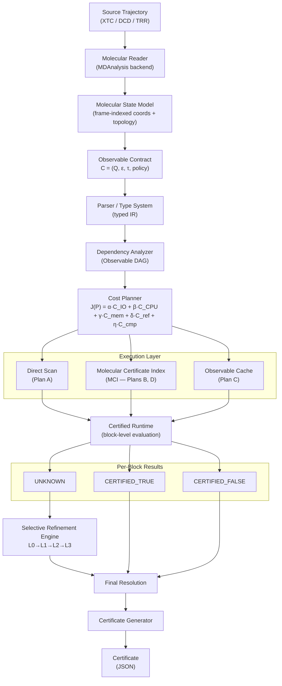

# MOCS-Cert: System Architecture

> **Document type**: Technical architecture specification  
> **Status**: V0.1.0 Design Baseline (Audit Revisions Applied)
> **Cross-references**: [FORMAL_SEMANTICS.md](FORMAL_SEMANTICS.md) · [MATHEMATICAL_MODEL.md](MATHEMATICAL_MODEL.md) · [CERTIFICATE_SPEC.md](CERTIFICATE_SPEC.md) · [CERTIFICATE_INDEX_SPEC.md](CERTIFICATE_INDEX_SPEC.md) · [QUERY_IR_AND_COMPILER.md](QUERY_IR_AND_COMPILER.md) · [DEVELOPER_ARCHITECTURE.md](DEVELOPER_ARCHITECTURE.md)

---

## Table of Contents

1. [Architecture Overview](#1-architecture-overview)
2. [Architecture Mermaid Diagram](#2-architecture-mermaid-diagram)
3. [Subsystem Descriptions](#3-subsystem-descriptions)
4. [Repository Structure](#4-repository-structure)
5. [Data Flow: Simple Distance Query](#5-data-flow-simple-distance-query)
6. [Data Flow: Complex Temporal Query](#6-data-flow-complex-temporal-query)
7. [Error Propagation Rules](#7-error-propagation-rules)
8. [Three Execution Modes](#8-three-execution-modes)
9. [Future Extension Points](#9-future-extension-points)

---

## 1. Architecture Overview

The following ASCII pipeline shows the complete end-to-end flow from source trajectory to certified result, including all major subsystems and decision branches.

```
Source trajectory (XTC / DCD / TRR)
        |
        v
[Molecular Reader]
  - Reads frames via MDAnalysis
  - Validates format and reports metadata
  - Fails clearly on unsupported formats
        |
        v
[Molecular State Model]
  - Frame-indexed coordinate store
  - Static topology reference
  - Orthorhombic PBC box (V0.1)
        |
        v
Observable Contract  C = (Q, epsilon, tau, policy)
        |
        v
[Parser / Type System]
  - Parses Python API calls into typed IR
  - Validates atom references vs. topology
  - Validates units, PBC mode, temporal semantics
        |
        v
[Dependency Analyzer --> Observable DAG]
  - Deduplicates shared sub-expressions
  - Assigns operator versions and parameter hashes
  - Outputs logical IR
        |
        v
[Cost Planner]
  J(P) = alpha*C_IO + beta*C_CPU + gamma*C_mem + delta*C_refine + eta*C_compile
  - Evaluates candidate plans A, B, C, D
  - Selects Pareto-efficient plan
        |
        v
    +---+----------+----------+
    |              |          |
    v              v          v
[Direct         [Certificate [Cache
  Scan]           Index]      Lookup]
  (Plan A)        (MCI)       (Plan C)
    |              |          |
    +---+----------+----------+
        |
        v
[Certified Runtime]
  - Evaluates block-level predicates
  - Returns per-block status
        |
        v
    +---+------------------+
    |          |            |
    v          v            v
CERTIFIED  CERTIFIED     UNKNOWN
  TRUE       FALSE          |
    |          |             v
    |          |     [Selective Refinement Engine]
    |          |       L0 coarse -> L1 medium
    |          |       L2 fine -> L3 exact frames
    |          |             |
    +----------+-------------+
               |
               v
       [Final Resolution]
               |
               v
       [Certificate Generator]
         - JSON execution certificate
         - Status, query, semantics, hashes,
           evidence blocks, refinement history,
           bytes inspected, compiler version
               |
               v
         [Certificate]
```

---

## 2. Architecture Mermaid Diagram



---

## 3. Subsystem Descriptions

Each subsystem is described below with: responsibilities, interfaces, inputs, outputs, dependencies, error propagation, failure modes, performance boundaries, and future extension points.

---

### 3.1 Molecular Reader

**Responsibilities**  
The Molecular Reader is the boundary between the raw trajectory file on disk and the rest of the MOCS-Cert system. It abstracts format-specific I/O details and presents a uniform frame-access interface to the Molecular State Model.

**Inputs**
- Absolute path to a trajectory file (XTC, DCD, or TRR in V0.1)
- Absolute path to a topology file (PSF, PDB, GRO, or equivalent)

**Outputs**
- Frame count N
- Timestep delta_t (ps), total time range [t_0, t_N]
- Box dimensions (a, b, c) for orthorhombic box (validated static for V0.1)
- Sequential frame iterator yielding (frame_index, timestamp, coordinate_array, box_array)
- Random-access frame retrieval by frame index (required for Selective Refinement Engine)

**Interfaces**  
Exposes `TrajectoryReader` protocol:
```python
class TrajectoryReader(Protocol):
    def metadata(self) -> TrajectoryMetadata: ...
    def __iter__(self) -> Iterator[Frame]: ...
    def seek(self, frame_index: int) -> Frame: ...
    def close(self) -> None: ...
```

**Dependencies**
- MDAnalysis >= 2.0 (V0.1 backend)
- Optional: MDTraj (future backend for hot-path refinement)

**Error Propagation**
- Unsupported format (e.g., TNG, H5MD): raises `UnsupportedFormatError`, propagates as `ERROR` status
- Corrupted file or truncated frame: raises `CorruptFrameError`, propagates as `ERROR` status
- Topology mismatch (atom count inconsistency): raises `TopologyMismatchError`, propagates as `ERROR` status
- Non-orthorhombic box detected: raises `UnsupportedGeometryError`, propagates as `UNSUPPORTED_GEOMETRY` status -- **this must not be silently swallowed**

**Failure Modes**
- File not found: immediate `ERROR` before any frame processing
- Box dimension change detected mid-trajectory (V0.1 restriction violated): `UNSUPPORTED_GEOMETRY`
- Memory exhaustion on large frame: `ERROR` with diagnostic

**Performance Boundaries**
- Sequential read throughput: bounded by disk I/O and XTC decompressor (HYPOTHESIS: ~50-200 MB/s on SSD)
- Random access (seek): O(1) with XTC byte-offset index; O(N) without index. The MCI manifest stores frame byte offsets to enable O(1) seek.
- Memory: One frame in memory at a time in streaming mode; coordinates for selected atoms only in refinement mode

**Future Extension Points**
- H5MD / MDAnalysis H5MD reader for parallel I/O
- Zarr-backed trajectory store for cloud access
- Streaming decompression plugin interface

---

### 3.2 Molecular State Model

**Responsibilities**  
The Molecular State Model maintains the frame-indexed representation of atomic coordinates, the static topology reference (atoms, bonds, residues, chains), and the PBC box. It is the internal data model that all observables and bounds computations query.

**Inputs**
- Frame stream from the Molecular Reader
- Topology object parsed from topology file

**Outputs**
- Atom position array X_k for a requested frame k, optionally filtered to an atom selection
- Topology object with atom index, name, residue, chain, element fields
- Box dimensions (a, b, c) for V0.1

**Static Topology Assumption**  
V0.1 assumes that the topology (atom identities, bond connectivity, residue assignments) does not change across frames. This is the standard assumption for fixed-topology MD simulations (no bond breaking/forming). If topology changes are detected (e.g., a file with changing atom counts), the reader raises `TopologyMismatchError`.

**Interfaces**
```python
class MolecularStateModel(Protocol):
    topology: Topology
    box: OrthorhombicBox
    def get_positions(self, frame: int, selection: AtomSelection) -> np.ndarray: ...
    def validate_selection(self, selection: AtomSelection) -> None: ...
```

**Error Propagation**
- Invalid atom selection (atom index out of range, non-existent residue): `TypeError` from the type system, propagated as `ERROR`
- Box change detected: `UnsupportedGeometryError` -> `UNSUPPORTED_GEOMETRY`

**Performance Boundaries**
- Coordinate extraction for a selection of size n_sel from a frame of size n_atoms: O(n_sel) with index-based extraction
- For AABB bound computation over a block of B frames: O(B * n_sel) coordinate reads

---

### 3.3 Observable Contract System

**Responsibilities**  
The Observable Contract System parses, validates, and internalizes the contract C = (Q, epsilon, tau, policy) that the user declares before query execution. It enforces the V0.1 scope restrictions and rejects unsupported configurations before any computation begins.

**Inputs**
- User-provided contract declaration (Python API call or JSON contract file)

**Outputs**
- Validated contract object `Contract` containing typed query set Q, numerical tolerances, temporal tolerance tau, and certification policy
- Rejection reason if contract is invalid

**V0.1 Scope Enforcement**  
The contract system rejects:
- Observable types not in {DISTANCE, CONTACT, HBOND}
- Temporal operators not in {FOR, BEFORE, AFTER, FOLLOWED_BY, WITHIN}
- PBC mode other than orthorhombic minimum-image
- Triclinic box dimensions (-> `UNSUPPORTED_GEOMETRY`)
- Negative or zero numerical tolerances

**Interfaces**
```python
class ContractValidator:
    def validate(self, raw_contract: dict) -> Contract: ...
    # Raises ContractValidationError with precise reason on rejection
```

**Error Propagation**
- Unsupported geometry in contract: immediate `UNSUPPORTED_GEOMETRY` before any trajectory reading
- Unsupported observable type: `ContractValidationError` -> `ERROR`
- Malformed tolerance (e.g., negative epsilon): `ContractValidationError` -> `ERROR`

**Failure Modes**
- Conflicting tolerance and policy (e.g., zero tolerance with PERMIT_UNKNOWN policy): `ContractValidationError`

---

### 3.4 Parser / Type System

**Responsibilities**  
The Parser / Type System translates user-facing Python API calls into a typed intermediate representation (IR). It validates all atom references against the topology, validates unit consistency, and validates temporal operator semantics before the Dependency Analyzer processes the IR.

**Inputs**
- Python API expression tree (from user query declaration)
- Topology object (for atom reference validation)
- Contract (for tolerance and PBC mode)

**Outputs**
- Typed logical IR tree for each query q_i in Q

**Type Checking Rules**
- `DISTANCE(sel_A, sel_B)`: sel_A and sel_B must resolve to non-empty atom selections in the topology
- `CONTACT(sel_A, sel_B, d_c)`: d_c must be a positive real number in angstroms
- `HBOND(sel_donor, sel_acceptor, d_c, theta_c)`: sel_donor must contain at least one hydrogen-capable atom; theta_c in degrees, 0 < theta_c < 180
- Temporal operators: time arguments must be in parseable units (ps, ns); durations must be positive; WITHIN requires a single duration argument

**Error Propagation**
- Empty atom selection: `SelectionError` -> `ERROR`
- Unknown residue or atom name: `SelectionError` -> `ERROR`
- Unit inconsistency: `UnitError` -> `ERROR`
- Temporal operator arity mismatch: `TemporalArityError` -> `ERROR`

**Future Extension Points**
- Query language surface syntax (text DSL) -> Parser front-end
- Schema-validated JSON contract as alternative input

---

### 3.5 Dependency Analyzer

**Responsibilities**  
The Dependency Analyzer builds the Observable Dependency DAG from the set of typed IR trees produced by the Parser / Type System. Its primary function is to identify shared sub-expressions across queries and deduplicate them, so that shared observables (e.g., a distance sub-expression shared between a CONTACT query and an HBOND query) are computed only once.

**Inputs**
- Set of typed logical IR trees for Q = {q_1, ..., q_n}
- Operator version table (maps observable type + parameter hash to a canonical version string)

**Outputs**
- Observable Dependency DAG: a directed acyclic graph where:
  - Leaf nodes are atomic observables (DISTANCE, CONTACT, HBOND) with unique keys
  - Internal nodes are temporal operators (FOR, BEFORE, AFTER, FOLLOWED_BY, WITHIN)
  - Edges represent data dependencies (a temporal operator depends on its observable arguments)
  - Shared sub-expressions are represented as single DAG nodes referenced by multiple parent nodes
- Deduplicated logical IR (one node per unique observable instance)

**Deduplication Key**  
Two observable instances are identical (and share a DAG node) if and only if all of the following match:
- Observable type
- Atom selection A (normalized canonical form)
- Atom selection B (normalized canonical form)
- All numerical parameters (d_c, theta_c, etc.)
- PBC policy
- Numerical tolerance policy
- Operator version string

**Interfaces**
```python
class DependencyAnalyzer:
    def build_dag(self, ir_trees: list[IRNode]) -> ObservableDAG: ...
```

**Error Propagation**
- Cyclic dependency detected (should be impossible from grammar; defensive check): `DAGCycleError` -> `ERROR`

**Performance Boundaries**
- DAG construction: O(|Q| * depth) where depth is the maximum nesting depth of temporal operators
- Deduplication lookup: O(1) with hash map keyed on canonical observable key

---

### 3.6 Cost Planner

**Responsibilities**  
The Cost Planner evaluates candidate execution plans for the Observable Dependency DAG and selects the plan with the lowest estimated total cost J(P) under the declared contract. The planner balances I/O reduction, CPU sharing, storage overhead, and compilation cost.

**Cost Model (Definition -- not proven optimal)**

```
J(P) = alpha * C_IO(P) + beta * C_CPU(P) + gamma * C_memory(P)
     + delta * C_refinement(P) + eta * C_compile(P)
```

The cost components are:
- `C_IO(P)`: estimated bytes read from trajectory (function of block pruning rate)
- `C_CPU(P)`: estimated floating-point operations (function of frames evaluated)
- `C_memory(P)`: estimated peak working set (function of materialized intermediates)
- `C_refinement(P)`: estimated cost of UNKNOWN block resolution (function of UNKNOWN fraction)
- `C_compile(P)`: cost of building MCI sidecar structures (one-time or amortized)

**Important**: The weights alpha, beta, gamma, delta, eta are MEASURED quantities calibrated on representative hardware by the MOBench benchmark suite. They are NOT assumed constants. The planner's cost estimates are HEURISTIC; the planner does not guarantee globally optimal plan selection.

**Candidate Plans**

| Plan | Name | Description |
|------|------|-------------|
| A | Direct Scan | Full sequential frame scan; no index; baseline |
| B | Indexed Distance Pruning + Exact | Use MCI AABB bounds to certify blocks; fall back to exact for UNKNOWN |
| C | Reusable Observable Cache | Materialize shared sub-expressions to sidecar; reuse across queries |
| D | Certificate Bounds + Hierarchical Refinement | Plan B + multi-level UNKNOWN resolution (L0->L1->L2->L3) |

**Plan Selection**
- For single queries with no sidecar: Plan A (direct scan) if no prior MCI exists
- For single queries with existing MCI: Plan B
- For multi-query workloads with shared dependencies: Plan C or D based on cost estimate
- Default for V0.1 research mode: Plan D (enables full experimental instrumentation)

**Interfaces**
```python
class CostPlanner:
    def estimate(self, dag: ObservableDAG, trajectory_meta: TrajectoryMetadata,
                 weights: CostWeights) -> list[PlannedExecution]: ...
    def select(self, plans: list[PlannedExecution]) -> PlannedExecution: ...
```

**Error Propagation**
- No feasible plan (e.g., UNSUPPORTED_GEOMETRY already detected): propagates immediately without plan construction
- Weight calibration missing: planner falls back to uniform weights with WARNING log entry

---

### 3.7 Molecular Certificate Index (MCI)

**Responsibilities**  
The MCI is the sidecar data structure stored in the `.mocs/` directory alongside the source trajectory. It stores pre-computed geometric metadata (block-level AABB bounds, selection motion summaries) that enables block pruning without reading all frame coordinates.

**Structure**

The MCI is a two-level hierarchy:

**Level 0 -- Trajectory-global metadata** (`manifest.json`):
- Source trajectory path and SHA-256 hash
- Topology path and hash
- Frame count, timestep, time range
- Box dimensions (static orthorhombic)
- Frame byte-offset index (for O(1) random seek)
- MCI schema version
- MOCS-Cert compiler version that built the sidecar

**Level 1 -- Lazy selection-specific motion summaries** (`selections/`):
- Built on demand when a query references a new atom selection
- Per-block AABB for each atom selection: `[x_min, y_min, z_min, x_max, y_max, z_max]` stored in `selections/{sel_hash}.bin` ($\mathcal{O}(M \cdot s)$ storage)
- Pairwise distance bounds are derived on the fly in $\mathcal{O}(1)$ operations per block during query execution; combinatorial pairwise bounds are NOT materialized on disk in V0.1
- Block size B (number of frames per block) is a tunable parameter; smaller B gives tighter bounds but more index entries

**AABB Distance Bounds (Definition)**  
For two atom selections A and B with AABBs `[Ax_min..Ax_max] x [Ay_min..Ay_max] x [Az_min..Az_max]` and similarly for B:

```
dx_min = max(0, max(Ax_min - Bx_max, Bx_min - Ax_max))
dy_min = max(0, max(Ay_min - By_max, By_min - Ay_max))
dz_min = max(0, max(Az_min - Bz_max, Bz_min - Az_max))

dx_max = max(|Ax_max - Bx_min|, |Ax_min - Bx_max|)
dy_max = max(|Ay_max - By_min|, |Ay_min - By_max|)
dz_max = max(|Az_max - Bz_min|, |Az_min - Bz_max|)

L = sqrt(dx_min^2 + dy_min^2 + dz_min^2)   -- distance lower bound
U = sqrt(dx_max^2 + dy_max^2 + dz_max^2)   -- distance upper bound
```

These are **data bounds** (derived directly from coordinate extrema within the block), not statistical models. L and U are guaranteed to satisfy L <= d_true(f) <= U for all frames f in the block, under the stated orthorhombic PBC semantics.

**PBC Handling in Bounds**  
For blocks near periodic boundaries, atom coordinates are evaluated under the guarded conservative PBC bounding algorithm (§5 of `MATHEMATICAL_MODEL.md`). Multi-crossing blocks and velocity guard violations fall back immediately to exact frame evaluation.

**Sidecar Layout**
```
trajectory.mocs/
  manifest.json          <- Level 0: global metadata + frame byte offsets
  blocks/
    block_meta.json      <- Block boundaries, sizes, timestamps
  selections/
    {sel_hash}.bin       <- Level 1: AABB motion summaries per selection (O(M*s))
  cache/
    {observable_key}.npy  <- Materialized observable time series & views
  certificates/
    {query_hash}.json    <- Stored JSON certificates for completed queries
  source-map/
    frame_offsets.bin    <- 64-bit frame byte-offset seek table
```

**Two-Tier Source Invalidation**  
The Certified Runtime verifies source integrity on every query using a fast Tier 1 check (file size, `mtime`, inode). If changed, or when running forensic validation, a full SHA-256 stream check is performed. If hashes differ, the sidecar is invalidated and rebuilt.

**See also**: [CERTIFICATE_INDEX_SPEC.md](CERTIFICATE_INDEX_SPEC.md) for the complete MCI specification.

---

### 3.8 Certified Runtime

**Responsibilities**  
The Certified Runtime is the execution engine that evaluates the physical execution plan produced by the Cost Planner. It applies block-level predicate evaluation using MCI bounds, aggregates per-block results under declared quantifiers, and coordinates with the Selective Refinement Engine for UNKNOWN blocks.

**Inputs**
- Physical execution plan (from Cost Planner)
- MCI (from sidecar or freshly built)
- Molecular State Model (for exact-frame access)
- Contract C

**Outputs**
- Per-block result: `{block_id, status: TRUE | FALSE | UNKNOWN, evidence, frames_inspected}`
- Query-level result: Decoupled Logical Truth (`TRUE` | `FALSE` | `UNKNOWN`) and Execution Resolution Status (`COMPLETE` | `NEEDS_REFINEMENT` | `UNRESOLVABLE_SAMPLING` | `UNSUPPORTED_GEOMETRY` | `UNSUPPORTED_SEMANTICS` | `ERROR`)

**Block-Level Predicate Evaluation**

For a CONTACT predicate `d(A, B) < d_c` over block k with distance bounds [L_k, U_k]:

```
if U_k < d_c:               -> TRUE   (all frames in block satisfy predicate)
if L_k >= d_c:              -> FALSE  (no frame in block can satisfy predicate)
otherwise:                  -> UNKNOWN (bounds do not resolve the predicate)
```

**Two-Stage HBOND Evaluation Pipeline (V0.1 Architecture)**
Because angular bounding via AABBs remains unvalidated and produces excessive interval overestimation, HBOND evaluation does **not** perform angular AABB certification:
1. **Stage 1 (Conservative Block Pruning):** Distance lower bound $L_{DA}$ is checked. If $L_{DA} \ge d_{\text{cutoff}}$, the block is certified `FALSE` without reading coordinates or computing angles.
2. **Stage 2 (Exact Frame Evaluation):** If $L_{DA} < d_{\text{cutoff}}$, the block status is `UNKNOWN`. The runtime reads the candidate block frames and evaluates exact per-frame distance and donor-H-acceptor angle criteria.

**Temporal Aggregation (Sampled-Frame Semantics)**

All temporal events are represented as half-open intervals $E = [k_s, k_e)$ with elapsed duration $(k_e - k_s)\Delta t$:
- For `FOR >= tau`: The query is certified `TRUE` if contiguous exact-verified frames span an elapsed duration $\ge \tau$. It is certified `FALSE` if the upper bound on the maximum possible continuation run of unrefuted frames is strictly $< \tau$.
- For `BEFORE(A, B)`: Certified `TRUE` under existential occurrence semantics if an occurrence of $A$ completes before an occurrence of $B$ begins ($a_e \le b_s$). If occurrences overlap, evaluates to `UNKNOWN`.

**Error Propagation**
- MCI hash mismatch: halt execution, return `ERROR` with diagnostic
- Exact-frame read failure during refinement: return `ERROR` for affected block
- Geometry violation detected at runtime: `UNSUPPORTED_GEOMETRY` for the query

---

### 3.9 Selective Refinement Engine

**Responsibilities**  
The Selective Refinement Engine resolves UNKNOWN blocks by applying progressively finer-grained evaluation strategies, up to and including exact per-frame coordinate computation. It implements a four-level hierarchy.

**Refinement Hierarchy**

| Level | Name | Strategy |
|-------|------|----------|
| L0 | Coarse block bounds | MCI AABB bounds at original block size B |
| L1 | Medium sub-blocks | Subdivide block into B/4 sub-blocks; recompute AABB bounds |
| L2 | Fine sub-blocks | Subdivide into individual frame groups of size ~10; recompute AABB bounds |
| L3 | Exact frames | Read and decompress individual frames; compute exact observable values |

The engine proceeds from L0 to L3 only as needed. A block that becomes CERTIFIED_TRUE or CERTIFIED_FALSE at L1 does not proceed to L2 or L3. The engine records the refinement level at which each block was resolved.

**Cost Control**  
The refinement engine respects a budget parameter `max_refinement_cost` from the contract policy. If the cost of L3 (exact frame) evaluation exceeds the budget, the engine returns UNKNOWN for that block rather than exceeding budget. This permits the researcher to receive partial results with explicit UNKNOWN regions.

**UNRESOLVABLE_SAMPLING Classification**  
If a block's UNKNOWN status persists even at L3 (exact frames), and the reason is that the observable transitions between TRUE and FALSE faster than the frame sampling rate (delta_t), the engine classifies it as `UNRESOLVABLE_SAMPLING`. This indicates that the original trajectory does not contain sufficient temporal resolution to answer the query in that region, and a new simulation with finer output stride would be required.

**Inputs**
- UNKNOWN block list from Certified Runtime
- MCI (for sub-block bound computation)
- Molecular State Model (for L3 exact access)
- Refinement budget from contract policy

**Outputs**
- Resolved status per UNKNOWN block: CERTIFIED_TRUE | CERTIFIED_FALSE | UNKNOWN | UNRESOLVABLE_SAMPLING
- Refinement level at which resolution occurred (for certificate)
- Bytes inspected during refinement (for cost accounting)

---

### 3.10 Mixed Array Acceleration Engine (mocs.arrays: JAX + NumPy + CuPy)

**Responsibilities**  
MOCS-Cert does not rely on single-threaded CPU NumPy alone for numerical operations. Mathematical bounding, periodic wrapping, and distance evaluation are powered by a unified multi-backend array abstraction (mocs.arrays) that dispatches seamlessly across:
1. **NumPy (CPU Reference & Interoperability):** Provides host-side coordinate slicing, zero-copy buffer handoffs with MDAnalysis format readers, and universal host fallback.
2. **CuPy (GPU Hardware Acceleration):** Provides CUDA and ROCm GPU array computation. Accelerates batch AABB bounding box derivation over millions of frames, pairwise distance evaluation on large molecular systems ( > 10^5$ atoms), and parallel spatial coordinate transforms with zero CPU-GPU round-trip penalty during scans.
3. **JAX (XLA JIT & Autodiff Compilation):** Employs jax.jit for ahead-of-time and just-in-time OpenXLA kernel compilation. Fuses elementwise coordinate transformations, minimum-image PBC shifts, and interval reductions into single GPU/CPU memory passes, eliminating intermediate array allocations. Vectorizes dyadic block partitions via jax.vmap.

**Hardware Dispatch Policy**  
The runtime dispatcher (mocs.arrays.dispatcher.get_backend()) evaluates available hardware at session initialization:
`
GPU with CUDA / ROCm detected -> CuPy / JAX (CUDA Backend)
CPU with AVX-512 / AVX2      -> JAX (CPU XLA JIT) + NumPy
Standard CPU fallback        -> NumPy
`
Zero-copy array handoffs between NumPy, CuPy, and JAX are achieved via __cuda_array_interface__ and DLPack protocols.

---

### 3.11 Certificate Generator

**Responsibilities**  
The Certificate Generator produces the machine-readable JSON execution certificate for each query, recording all information needed for independent result verification.

**Certificate Schema (Summary)**

```json
{
  "mocs_version": "0.1.0",
  "certificate_schema_version": "1.0",
  "query_hash": "<sha256 of canonical query representation>",
  "query_text": "<human-readable query expression>",
  "contract": {
    "epsilon_r": 0.01,
    "epsilon_theta": 1.0,
    "tau_min_ps": 10.0,
    "pbc_mode": "orthorhombic_minimum_image",
    "certification_policy": "CONSERVATIVE"
  },
  "trajectory": {
    "path": "<absolute path>",
    "sha256": "<hex>",
    "frame_count": 100000,
    "timestep_ps": 0.01,
    "box_angstrom": [80.0, 80.0, 80.0]
  },
  "topology": {
    "path": "<absolute path>",
    "sha256": "<hex>"
  },
  "result": {
    "status": "CERTIFIED_TRUE",
    "evidence_blocks": [
      {"block_id": 42, "frames": [4200, 4299], "status": "CERTIFIED_TRUE",
       "refinement_level": 0, "lower_bound_A": 2.1, "upper_bound_A": 3.4}
    ],
    "unknown_blocks": [],
    "bytes_inspected": 12345678,
    "frames_inspected_exact": 0
  },
  "execution": {
    "plan": "D",
    "plan_rationale": "Multi-query workload with shared DISTANCE sub-expression",
    "wall_time_s": 4.2,
    "compiler_version": "0.1.0"
  }
}
```

**Verifiability**  
A certificate is considered machine-verifiable if a third party can, given the certificate and the original trajectory file (verified by SHA-256 hash), re-execute only the exact-frame evaluations listed in `evidence_blocks` and obtain the same result. The certificate does not require re-running the full plan.

**See also**: [CERTIFICATE_SPEC.md](CERTIFICATE_SPEC.md) for the complete schema.

---

### 3.11 Observable Cache

**Responsibilities**  
The Observable Cache stores reusable intermediate observable results to enable shared sub-expression reuse across queries in a multi-query workload.

**Cache Key**  
Each cache entry is keyed by the tuple:

```
(source_trajectory_sha256, topology_sha256, operator_type, operator_version,
 selection_hash_A, selection_hash_B, parameter_hash, pbc_policy_hash, numerical_policy_hash)
```

All components must match exactly for a cache hit. The source and topology hashes ensure that cache entries are invalidated when the trajectory or topology changes.

**Stored Content**
- `distance_series`: NumPy float32 array of length N_frames (distance per frame)
- `contact_events`: list of (start_frame, end_frame) intervals where contact predicate is TRUE
- `hbond_events`: list of (start_frame, end_frame) intervals where HBOND predicate is TRUE
- `block_bounds`: NumPy array of (L_k, U_k) per block (AABB-derived distance bounds)

**Cache Invalidation**
- Source trajectory hash change: full cache invalidation
- Topology hash change: full cache invalidation
- Operator version change: selective invalidation of affected observable types

**Storage Location**: `trajectory.mocs/cache/` and `trajectory.mocs/events/`

**Performance Boundaries**  
Cache read for a materialized distance series of N_frames = 100,000 frames: O(N_frames) sequential read, bounded by disk I/O. Cache hit avoids the O(N_frames * C_read + C_decompress) cost of a trajectory scan.
